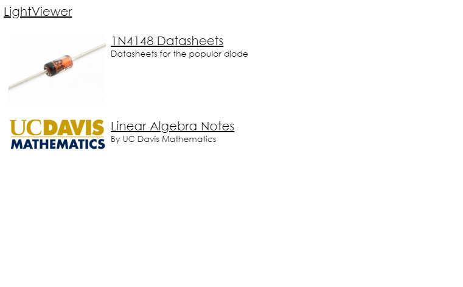
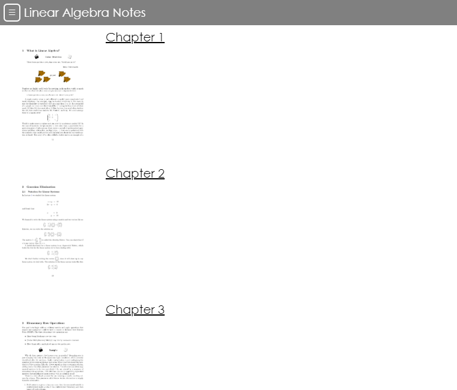

# LightViewer
Lightweight React-based web application to view images


# Features
- Light: Loads and runs quickly
- Minimal dependencies: React and jQuery
- Images organized by group and subgroup
- Bookmarkable URLs

# Screenshots

#

#

#

#

#

# Config
**lightviewer_config.json**

This is the main configuration file and should be in the public folder.
```
{
  "groupListFile": "group_list.json",  // File to declare groups
  "buttonConfig": {                    // Config for button
    "delayTime": 100,                  // Time shown
    "buttonWidth": 0.2,                // Ratio width of button
    "triangleLength": 15               // Length of arrow
  }
}
```

**group_list.json**

File in which groups are declared
```
{
  "list": [
    {
      "name": "1N4148 Datasheets",                    // Name of group
      "directory": "1n4148",                          // Directory
      "imagePrefix": "",                              // Text before number in image filenames
      "imagePostfix": ".jpg",                         // Text after number in image filenames
      "subtext": "Datasheets for the popular diode",  // Subtext under group title
      "thumbnail": "1n4148.jpg",                      // Thumbnail for group, must be relative to directory
      "subgroupListFile": "1n4148.json"               // File to declare subgroups
    },
    {
      "name": "Linear Algebra Notes",
      "directory": "linear",
      "imagePrefix": "",
      "imagePostfix": ".jpg",
      "thumbnail": "thumb.png",
      "subtext": "By UC Davis Mathematics"
    }
  ]
}
```

**subgroup_list.json**

File in which subgroups are declared

```
{
  "list": [
    {
      "name": "ON Semiconductor",                   // Title of subgroup
      "directory": "on",                            // Directory of subgroup, must be relative to directory of group
      "thumbnail": "1N914-D-1801484-page-001.jpg",  // Thumbnail for subgroup, must be relative to directory of subgroup
      "imagePrefix": "1N914-D-1801484-page-00",     // Text before number in image filenames, overrides group imagePrefix
      "imagePostfix": ".jpg"                        // Text after number in image filenames, overrides group imagePostfix
    },
    {
      "name": "VISHAY",
      "directory": "vishay",
      "thumbnail": "1n4148-page-001.jpg",
      "imagePrefix": "1n4148-page-00",
      "imagePostfix": ".jpg"
    },
    {
      "name": "Diodes Incorporated",
      "directory": "ds",
      "thumbnail": "ds12019-page-001.jpg",
      "imagePrefix": "ds12019-page-00",
      "imagePostfix": ".jpg"
    }
  ]
}

```
